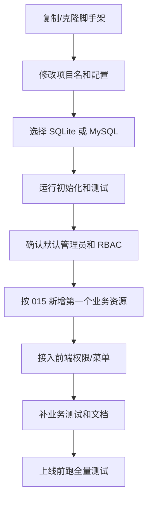

# 脚手架复用适用性审查

> 角色视角：产品经理、项目经理、开发顾问。  
> 核心问题：当前项目是否可以达到“后台管理脚手架”的目的，让多个类似项目快速搭建系统，节省时间，避免重复开发？  
> 评估原则：不为了轻量而砍掉后台核心能力，也不为了通用而做重型平台；坚持小而美的瑞士军刀。

## 1. 结论

结论：**可以作为后台管理类项目的轻量脚手架基础，已经具备复用价值；但要把它真正变成高效率脚手架，还需要补齐“新项目上手入口”和“资源生成/接入标准化”的最后一公里。**

当前已经具备脚手架内核能力：

- 应用启动：`createApp()`、`bootstrapApp()`、`startServer()` 已拆分。
- 认证：Local JWT、refresh token 服务端会话、AuthProvider seam 已具备。
- 用户：注册、登录、当前用户、用户列表、创建、更新、软删除、批量操作已具备。
- RBAC：角色、权限、用户角色、角色权限、直接授权、deny 优先、轻量 RBAC 管理接口已具备。
- 前端门禁：当前用户权限、菜单、按钮权限接口已具备。
- 数据库：SQLite 默认可用，MySQL 幂等建表、seed、真实连接测试已通过。
- 审计：用户和 RBAC 高风险写操作已有审计记录。
- 测试：核心接口、认证流、RBAC、MySQL 初始化有测试。
- 文档：接口契约、前端契约、RBAC、MySQL、资源接入指南、架构总览已沉淀。

因此，从“多后台项目复用”的目标看，本项目不是 Demo，而是已经接近一个可复制的后台基础框架。

## 2. 能节省哪些重复开发时间

| 重复开发项 | 当前是否已沉淀 | 对新项目的节省价值 |
| --- | --- | --- |
| 项目启动与 Hono app 结构 | 已沉淀 | 省去基础工程搭建 |
| 统一配置读取 | 已沉淀 | 减少环境配置重复代码 |
| SQLite/MySQL 初始化 | 已沉淀 | 新项目可直接建表和 seed |
| 注册/登录/刷新/登出 | 已沉淀 | 省去认证基础流 |
| refresh token 会话状态 | 已沉淀 | 省去安全细节踩坑 |
| 用户管理接口 | 已沉淀 | 后台常规用户页可复用 |
| RBAC 模型与 seed | 已沉淀 | 省去权限表和默认角色设计 |
| RBAC 管理接口 | 已沉淀 | 省去角色分配/授权接口 |
| 当前权限/菜单/按钮 | 已沉淀 | 前端路由守卫和按钮控制可复用 |
| 审计日志模型 | 已沉淀 | 高风险操作可追踪 |
| 健康检查 | 已沉淀 | 上线检查基础能力可复用 |
| 测试脚本 | 已沉淀 | 复制项目后可快速验收 |

产品视角判断：这些都是后台管理项目最容易重复写、最容易写散、最容易出现安全漏洞的能力，适合作为脚手架默认内核。

## 3. 当前作为脚手架的成熟度

### 3.1 成熟度评分

| 维度 | 评分 | 说明 |
| --- | --- | --- |
| 快速启动 | 4/5 | `bun install`、SQLite、`bun run dev` 基本可跑，但 README 需要同步最新架构 |
| 认证复用 | 4/5 | Local JWT 已闭环，Logto 保持可选 seam |
| 用户管理复用 | 4/5 | 基础接口完整，控制器后续可小步拆分 |
| RBAC 复用 | 4/5 | 模型、seed、管理接口、前端权限已具备 |
| 新增业务资源 | 3/5 | 有指南，但还没有模板/生成脚本 |
| 数据库复用 | 4/5 | SQLite/MySQL 都验证，生产迁移系统暂不需要 |
| 前端集成 | 4/5 | 契约清晰，但没有配套前端模板 |
| 文档可交接 | 4/5 | 文档已较完整，但 README 入口滞后 |
| 防过度设计 | 4/5 | 当前未引入重型 IAM/多租户/审批流 |
| 多项目复制效率 | 3.5/5 | 可复制使用，但项目重命名、模块裁剪、资源生成仍需手工 |

综合评分：**4/5，已适合作为内部后台脚手架试用；若要成为长期复用模板，需要补齐脚手架入口和资源模板。**

## 4. 产品经理视角：是否符合目标用户需求

目标用户：经常搭建后台管理系统的开发者或小团队。

他们最关心：

1. 能不能快速跑起来？
2. 用户、角色、权限能不能直接用？
3. 前端能不能快速接？
4. 新增业务表时有没有套路？
5. 后续部署和数据库切换会不会踩坑？
6. 不需要的能力能不能先不用？

当前项目的匹配情况：

- 快速跑起来：基本满足。
- 用户权限直接用：满足第一版。
- 前端接入：有契约，满足接口层；缺少前端样板。
- 新增业务表：有文档流程，缺少代码模板或生成器。
- 数据库切换：SQLite/MySQL 已验证。
- 可裁剪：概念上可裁剪，但缺少模块开关说明。

产品结论：**方向正确，核心价值明确；下一步不应继续堆功能，而应优化“第一次使用体验”和“新增资源效率”。**

## 5. 项目经理视角：交付效率与风险

### 5.1 可以节省的交付周期

对于一个普通后台项目，使用该脚手架预计可节省：

- 工程初始化：0.5-1 天。
- 认证和会话：1-2 天。
- 用户管理：1-2 天。
- RBAC 表结构与接口：2-4 天。
- 前端权限契约沟通：0.5-1 天。
- MySQL 初始化与 seed：0.5-1 天。
- 基础测试与踩坑：1-2 天。

保守估计：**每个类似后台项目可节省 5-10 个工作日**，同时降低认证/RBAC/数据库初始化踩坑风险。

### 5.2 当前交付风险

| 风险 | 影响 | 建议 |
| --- | --- | --- |
| README 入口滞后 | 新人按旧说明接入会走偏 | 立即同步 README |
| 新增资源仍偏手工 | 多项目复用时仍会复制粘贴 | 先补模板文档，再考虑生成器 |
| UserController 偏大 | 后续认证改动容易影响用户管理 | 小步拆 AuthController |
| 测试数据共享 | 测试互相污染概率增加 | 后续整理测试隔离 |
| 缺少模块裁剪说明 | 新项目不知道哪些能删 | 文档补“保留/可裁剪模块” |
| README 中 `.env.example` 可能不存在或滞后 | 快速开始断点 | 修正为当前真实配置方式 |

项目管理结论：**当前最大阻力不是功能不足，而是脚手架交付体验还不够产品化。**

## 6. 开发顾问视角：最佳实践符合度

### 6.1 已符合的最佳实践

- 入口分离：创建 app、初始化、启动服务分离。
- 认证 seam：保留 AuthProvider，不绑定单一未来方案。
- 最小可用 RBAC：默认角色、权限命名、deny 优先、管理接口都已具备。
- 服务端 refresh token 状态：不是纯无状态 refresh token。
- 数据库双路径验证：SQLite 本地，MySQL 真实连接测试。
- 审计日志：高风险写操作有记录。
- 文档契约：接口、前端、RBAC、MySQL、资源接入均有文档。
- 不过度平台化：没有默认引入多租户、审批流、插件系统。

### 6.2 仍需收敛的最佳实践

- 控制器职责继续收敛：优先拆 AuthController。
- 新增资源套路模板化：减少复制粘贴。
- README 必须成为真实入口：不能与当前代码偏离。
- 测试命令应更直观：`bun run test:all` 比 `bun run tests/run-tests.js` 更适合脚手架用户。
- 模块裁剪要有清单：哪些是核心必留，哪些项目可删。

## 7. 不应继续扩大的范围

为了保持“小而美瑞士军刀”，以下能力不应放入默认主线：

- 完整 IAM 平台。
- 复杂组织/租户/部门/岗位体系。
- 数据权限表达式引擎。
- 审批流引擎。
- 工作流引擎。
- 插件市场。
- 低代码表单/菜单/权限设计器。
- 多数据库迁移回滚平台。
- 内置前端管理系统大而全模板。

这些能力不是没有价值，而是会把脚手架推向重型平台。正确做法是保留 seam 和文档，等具体项目需要时作为项目级扩展。

## 8. 应该保留的核心内核

脚手架默认内核建议固定为：

```text
应用入口 + 配置 + 日志 + 错误处理 + 安全中间件
认证 + 用户 + RBAC + 当前权限/菜单
SQLite/MySQL 初始化 + 默认 seed
健康检查 + 审计日志
接口契约 + 前端契约 + 新增资源指南
```

这些能力与后台项目高度相关，删除后会在每个项目重新出现，符合“删除测试”：删掉并不会让复杂度消失，只会让复杂度扩散到新项目中。

## 9. 新项目使用路径建议

理想脚手架使用路径应是：



当前已经能做到 A-D，大体能做到 E-G，但 F-G 还偏手工。

## 10. 下一步路线图

### P0：脚手架入口修正

必须优先做：

1. 同步 README，使其与当前架构、路由、测试命令一致。
2. 明确快速开始：SQLite 路径、MySQL 路径、默认管理员、测试命令。
3. 明确脚手架复制后必须改哪些配置。
4. 增加 `test:all` 脚本，降低新用户记忆成本。当前已补充 `bun run test:all`。

### P1：提升新增资源效率

建议做：

1. 在 `docs/015` 基础上补一个最小业务资源示例，例如 `posts` 或 `projects`。当前已补充 `019_最小业务资源模板_2026-07-05.md`。
2. 提供一组模板文件：model/controller/routes/schema/test/doc checklist。当前已在 `019` 中提供文档级模板，暂不生成实际业务代码。
3. 暂不做自动代码生成器，先用模板验证流程。
4. 当模板在 2-3 个项目重复使用后，再考虑 `bun run scaffold:resource posts`。

### P2：小步重构而非大拆

建议做：

1. 拆 `AuthController`，保持 URL 不变。
2. 让 `UserController.getUsers()` 改读 `validatedQuery`。
3. 第三个业务资源出现后再抽审计 helper。
4. 不做通用 CRUD Controller。

### P3：持续质量

建议做：

1. 接入 CI：SQLite 全量测试 + MySQL 测试库集成测试。
2. 整理测试数据隔离。
3. 补模块裁剪指南。
4. 如果生产多版本升级变复杂，再写 ADR 评估迁移系统。

## 11. 最终建议

作为产品经理：**这个项目具备脚手架价值，核心能力选得对，不应该为了 lite 删除用户、RBAC、MySQL、审计这些后台核心能力。**

作为项目经理：**下一阶段优先提升上手效率和复制效率，而不是继续扩功能。README、测试命令、资源模板比新增复杂模块更重要。**

作为开发顾问：**当前架构不需要大重构。只建议小步拆认证控制器、收敛请求参数读取、沉淀资源模板。任何抽象都必须证明能减少多个项目的重复代码。**

一句话结论：

> 当前项目可以作为后台管理脚手架的基础版本；下一步要把“能用”打磨成“好复用”，重点是入口文档、资源模板、少量小步重构，而不是继续堆功能或做平台化设计。
